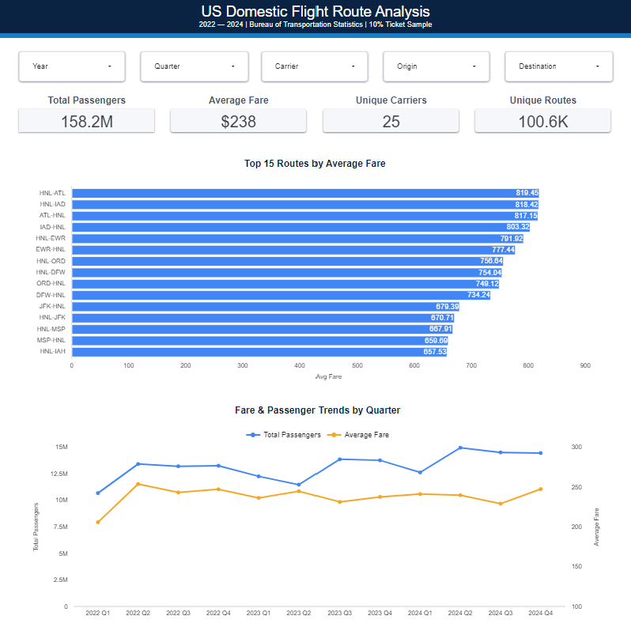
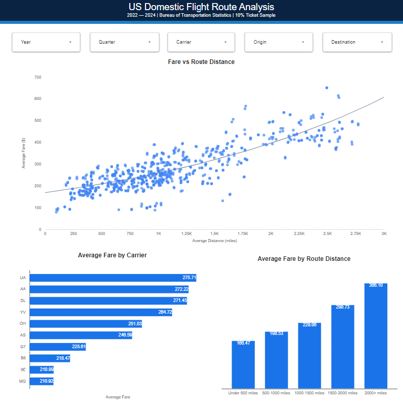
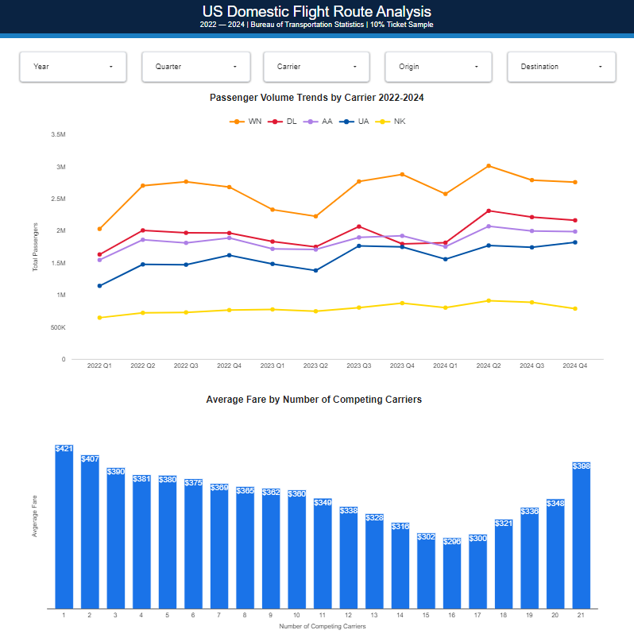

# US Domestic Flight Route Analysis
### SQL · BigQuery · Looker Studio

Analyzing what drives fare variation across US domestic aviation using 88.5 million flight records from the Bureau of Transportation Statistics (2022-2024).

[View Live Dashboard](https://datastudio.google.com/reporting/e96bd2f0-18b3-4993-a5a9-f3083573e1bb)

---

## Business Context

What determines what you pay for a domestic flight? This project investigates the drivers of fare variation across US domestic aviation, analyzing how route distance, carrier strategy, and market competition each contribute to pricing differences across 100,000+ routes.

Using three years of post-COVID recovery data (2022-2024), this analysis answers:

- Which routes generate the highest average fares?
- Does route distance predict fare, and by how much?
- How does carrier strategy affect pricing?
- Does competition drive fares down, and is there a floor?
- What seasonal patterns drive domestic passenger demand?

---

## Dataset

| Detail | Value |
|---|---|
| Source | Bureau of Transportation Statistics — DB1B Market Survey |
| Coverage | 2022, 2023, 2024 |
| Raw records | 88.5 million rows |
| Sampled passengers | 158 million |
| Unique routes | 100,600+ |
| Unique carriers | 25 |

**Note:** DB1B is a 10% systematic sample of all US airline tickets from reporting carriers. Figures represent sampled records. Analysis excludes fares below $10 and zero-passenger records to remove bulk fares and data errors.

---

## Tools

| Tool | Purpose |
|---|---|
| Google BigQuery | Cloud data warehouse — storage and SQL analysis |
| SQL | Data transformation, aggregation, and modeling |
| Looker Studio | Interactive dashboard |
| GitHub | Version control and portfolio hosting |

---

## Key Findings

**1. Hawaii routes dominate the highest fares**
All 15 top-fare routes connect Hawaii to mainland US hubs. HNL-ATL averages $819, nearly 3.5x the market average of $238. Hawaii routes represent the longest domestic segments in the US, and the data shows distance is the primary driver of elevated fares on these routes.
 
**2. Distance is the strongest predictor of fare**
There is a clear positive correlation between route distance and average fare. Routes under 500 miles average $168 while routes over 2,000 miles average $366, a 118% increase driven largely by distance.
 
**3. Major carriers price above the market average**
United ($276), American ($272), and Delta ($271) all price above the $238 market average. Budget carriers like Spirit ($211) price significantly lower, consistent with deliberate low-cost positioning.
 
**4. Competition drives fares down, but only to a floor**
Single-carrier monopoly routes average $421. Fares decline steadily as competition increases, reaching a floor of $296 at 16 competing carriers. Beyond that point fares rise again, reaching $398 at 21 carriers on ultra-competitive long-haul routes, suggesting price floors are structural rather than purely competitive.
 
**5. Southwest dominates domestic passenger volume**
Southwest (WN) consistently carries more passengers than any other carrier across all 12 quarters, roughly 30-40% more than Delta and American in peak periods. Volume leadership does not translate to fare leadership.
 
**6. Passenger growth outpaced fare growth post-COVID**
Total passengers grew from roughly 10.5M per quarter in early 2022 to 14M by late 2024, a 33% increase. Average fares peaked in 2022 around $270 and declined to $235 by 2024 as supply caught up with demand.

---
 
## Limitations and Caveats
 
Fare variation in aviation is driven by many factors beyond what this analysis captures, including booking window, fare class mix, fuel costs, load factor, and real-time revenue management decisions. The DB1B dataset reflects final ticket prices at the market level, not the dynamic pricing logic behind them.
 
The findings here identify structural correlations between distance, competition, and carrier strategy rather than a complete causal model of fare determination. A more complete model would incorporate booking lead time, fare class distribution, aircraft type, load factor by route, and carrier-specific revenue management strategies.

---
 
## Dashboard

### Page 1 — Market Overview

 
### Page 2 — Route Analysis

 
### Page 3 — Market Dynamics

